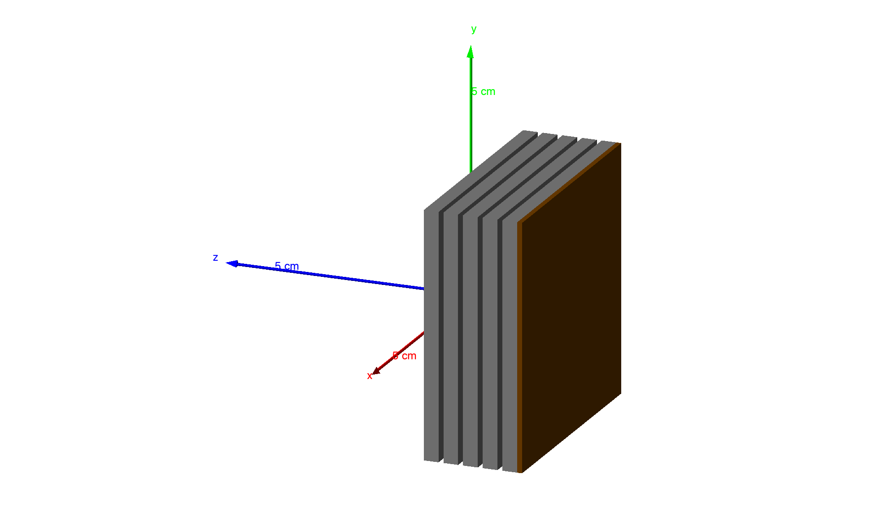

# ActiveTargetSim: Muon Production and Stopping Target Simulation

**Author:** Mohammadreza Zakeri (Zaki)  
**Contact:** m.zakeri@eku.edu  
**Created:** April 2025  
**Simulation Framework:** [Geant4](https://geant4.web.cern.ch/)

---

## Overview

**ActiveTargetSim** is a Geant4-based simulation toolkit designed to study the generation, moderation, and stopping behavior of muons in layered target geometries. The simulation provides a testbed for understanding muon production and transport in dense materials and supports future R&D in muon-catalyzed fusion and applied particle beam technologies.

Key capabilities include:

- Configurable converter stacks with varying material thicknesses
- Longitudinal and radial muon diagnostics
- Target-layer indexing
- Visualization and filtering of muon-containing events only

Recent updates add a **D-T gas region** for potential fusion capture, along with **event-level filtering** to selectively visualize events with muon production.

---

## Key Features

- **Modular detector geometry:**
  - Thin graphite target for initial proton collisions
  - Gradient-thickness tungsten converter stack (e.g., 2.0 mm to 0.2 mm)
  - Optional D-T gas capture region placed downstream
- **Muon diagnostics with ROOT histograms:**
  - Muon creation energy
  - Longitudinal and radial stopping locations
  - Target volume index
  - D-T region stop statistics
- **Localized uniform magnetic field** applied in D-T region
- **G4SmoothTrajectory-based visualization** for particle tracking
- **Selective event retention** for GUI: only muon-producing events are visualized
- Fully commented source with **Doxygen support**

---

## Detector Geometry (Figure 1)



**Figure 1**: _Perspective view of the simulated detector. The upstream graphite target produces pions, which decay into muons. Muons traverse a gradient stack of tungsten converters, and surviving particles may enter a D-T gas region under a magnetic field for potential capture._

---

## Output Histograms

ROOT histograms are automatically generated for each run. Histograms include:

| Histogram              | Description                                   |
| ---------------------- | --------------------------------------------- |
| **MuonEnergy.pdf**     | Distribution of muon creation energies (MeV)  |
| **MuonStopZ.pdf**      | Z-position of muon stopping                   |
| **MuonStopRadius.pdf** | Radial distance from beamline at stop         |
| **MuonStopTarget.pdf** | Target volume index where muon stopped        |
| **muonStopZ_DT.pdf**   | Z-position of muons stopped inside D-T region |
| **muonStopR_DT.pdf**   | Radial stop distance inside D-T gas region    |

---

## How to Build

```bash
mkdir build && cd build
cmake ..
make
```

Make sure Geant4 (with environment variables) is properly configured.

---

## How to Run

### Interactive Mode (with Visualization)

```bash
./active_target_sim
```

This uses `vis.mac` to render the detector and muon tracks.

### Batch Mode

```bash
./active_target_sim run.mac
```

Output is stored in `muon_output.root` by default.

---

## Generating Documentation

If Doxygen is installed, you can generate full HTML and PDF documentation:

```bash
doxygen Doxyfile
```

- HTML: `doc/html/index.html`
- PDF: `doc/latex/refman.pdf`

---

## Physics Motivation

Muon production begins with proton–nucleus collisions in the upstream graphite target, generating pions that decay in flight. The design uses high-density tungsten converters to moderate and stop muons.

New features include a **D-T gas region** with a localized magnetic field to explore the possibility of capturing muons in a fusion-relevant context. While full modeling of fusion reactions is outside current scope, this setup opens the door to downstream integration with fusion reaction models.

The simulation is well-suited for:

- Muon beamline studies
- Target design optimization
- Precursor designs for muon-catalyzed fusion systems

---

## Current Limitations and Future Directions

- **Pion absorption** vs. **decay-in-flight** remains a key design tradeoff. Many pions decay inside the tungsten converter layers, limiting escape probability.
- **D-T fusion interaction modeling** is **not yet implemented**. However, the current geometry and field setup support future addition of cross-section-based reaction tracking or yield estimation.

### To-Do / Next Steps

- Implement angular collimation or magnetic steering before D-T region
- Investigate pion decay lengths vs. absorption lengths in tungsten
- Extend detector with scoring planes or time-of-flight windows
- Add secondary reaction modeling (e.g., fusion triggers)

---

## License

This project is open for academic and research use. Please cite or link to this repository if you use or modify the code.

---
