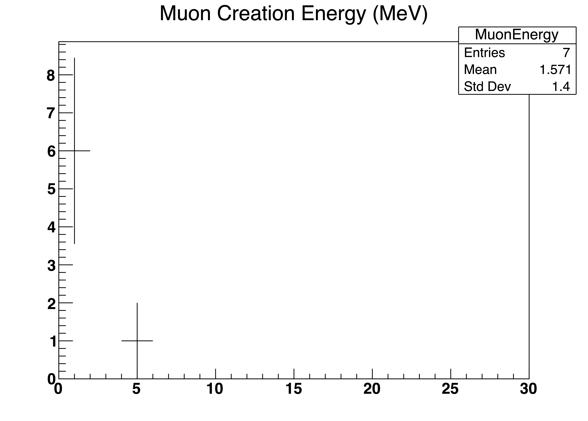

# ActiveTargetSim: Muon Production and Stopping Target Simulation

**Author:** Mohammadreza Zakeri (Zaki)  
**Contact:** m.zakeri@eku.edu  
**Created:** April 2025  
**Simulation Framework:** [Geant4](https://geant4.web.cern.ch/)

---

## Overview

**ActiveTargetSim** is a Geant4-based simulation toolkit designed to study the generation, transport, and stopping behavior of muons in a layered target geometry. The simulation enables controlled testing of muon-producing targets and potential moderation schemes, supporting future work in muon-catalyzed fusion and related areas of applied particle physics.

The code allows for flexible target geometries, including:

- **Thin graphite targets** for primary proton interactions
- **Tungsten converter stacks** to produce and absorb muons
- Optional **carbon stack** and **alternating moderator-absorber configurations**

The simulation tracks:

- Muon creation energy
- Stopping location (in space and in material)
- Radial displacement from beam axis
- Target layer index of final muon stop

---

## Features

- Modular geometry configuration (select via `SetDetectorType`)
- Uniform magnetic field applied along the beam axis
- ROOT histogram output for:
  - Muon creation energy
  - Muon stopping depth \( z \)
  - Muon radial stop distance \( r \)
  - Target layer index where muon stops
- Clear tracking of particle trajectories using G4SmoothTrajectory
- Debug messages for muon creation and stopping events

---

## Detector Geometry (Figure 1)


**Figure 1**: _Perspective view of the detector geometry in the ActiveTargetSim simulation. The five grey slabs represent tungsten converter layers used for muon production and stopping analysis. The thin brown slab upstream (rightmost slab in image) is the primary graphite target where incoming protons interact to produce secondary particles including muons. The visualization omits the world volume for clarity._

---

## Output Histograms

Generated using ROOT via Geant4’s G4AnalysisManager. Example plots below were created from 1000 events.

| Histogram              | Description                                         |
| ---------------------- | --------------------------------------------------- |
| **MuonEnergy.pdf**     | Distribution of muon creation energies (in MeV)     |
| **MuonStopZ.pdf**      | Longitudinal stopping positions of muons (in mm)    |
| **MuonStopRadius.pdf** | Radial stopping distance from beam axis (in mm)     |
| **MuonStopTarget.pdf** | Histogram of which target index the muon stopped in |

Example:



**Figure 2**: Histogram of muon creation energies.

---

## How to Build

Ensure that you have Geant4 (with data libraries and environment variables properly set) and optionally Graphviz (for Doxygen diagrams) installed.

```bash
mkdir build && cd build
cmake ..
make
```

---

## How to Run

### Interactive Mode (with Visualization)

```bash
./active_target_sim
```

The simulation uses the vis.mac file to render geometry and track visuals.

### Batch Mode

```bash
./active_target_sim run.mac
```

---

## Generating Documentation

If Doxygen is installed, you can generate HTML and PDF documentation with:

```bash
doxygen Doxyfile
```

Output will be available in the doc/html and doc/latex directories.

---

## Future Directions

This simulation serves as a foundation for exploring detector layouts and beamline optimization in muon-related applications. While the code is not specific to muon-catalyzed fusion, its modularity supports extensions toward that direction.

---

## License

This project is open for academic and research use. If you use this code in your work, please cite this repository or contact the author.
